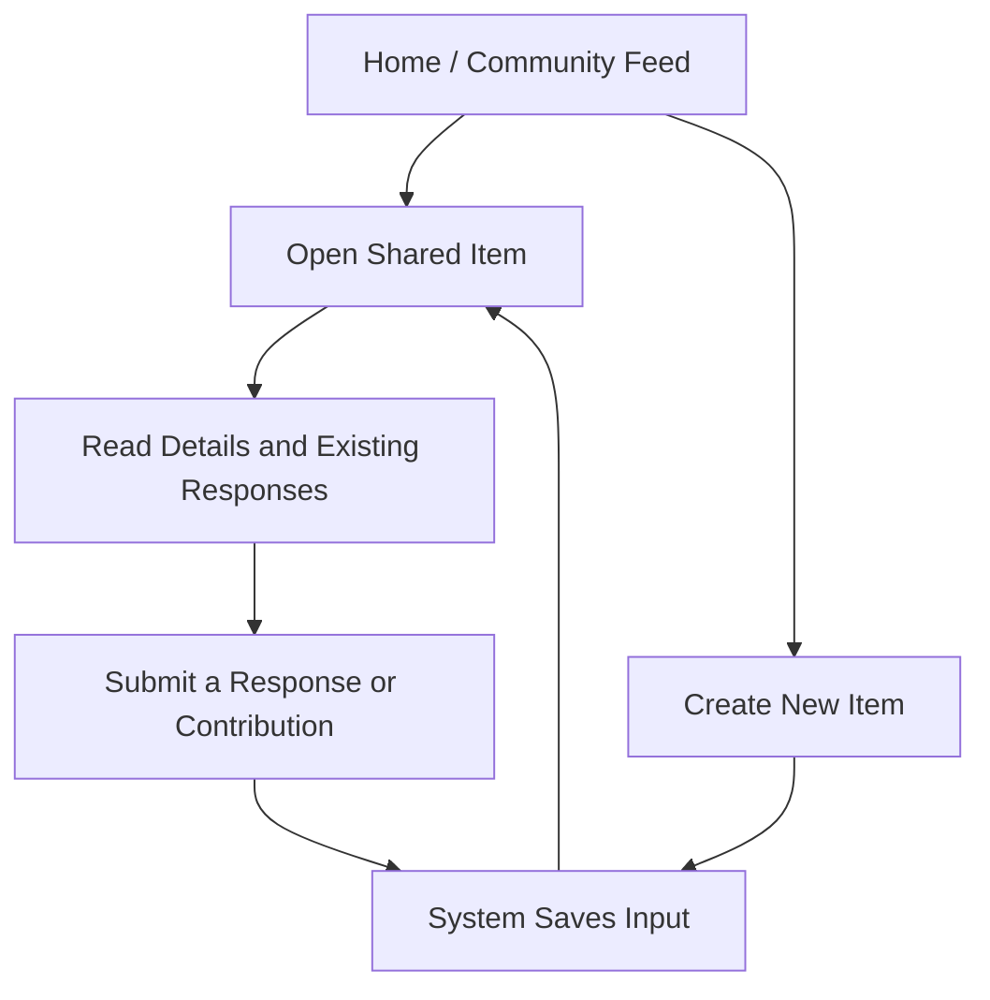

After the first stage of interpreting the BlaBla brief, I realised that listing possible features is not enough to define a strong web application. A feature list can make the project look larger than it really is, but it does not explain how users move through the system or what the application should actually help them complete. At this stage, my focus is to translate early functional requirements into a clearer application flow.

The key shift in my thinking is that a web application is not just a set of pages. A website mainly presents content, but a web application facilitates tasks. Users do not only browse; they interact with a system that responds. This means a normal sitemap is useful, but limited. It can show page hierarchy, but it does not fully show what users can do on each page, what choices they face, or how the system should respond after each action.

For the prototype, I think the application should be built around one core user journey: a logged-in member enters the community hub, browses shared content, opens a specific item, and responds through a lightweight interaction. This flow is simple, but it helps define what the prototype must do. The home page should not only introduce the community; it should act as an entry point into current activity. The detail page should not only display content; it should support deeper interaction. A contribution form should not exist as a separate decorative feature; it should connect directly to the community’s shared information.

A basic version of the flow can be described like this:

This flow helped me separate essential requirements from optional ones. The essential requirements are: users need to view shared content, open individual content items, create a new item, and submit a response. These actions are enough to test whether the application supports meaningful community exchange. By contrast, features such as notifications, complex profiles, recommendations, or real-time chat may sound attractive, but they would increase technical complexity without being necessary for the prototype’s core value.

This also affects technical planning. Viewing content can be handled through GET routes because the user is only requesting information from the server. Creating a new item or submitting a response should use POST because these actions change server-side data. Since the course stack uses MojoJS, SQLite, and HTMX, this structure is feasible: MojoJS can handle routes, SQLite can store shared items and responses, and HTMX can improve small interactions such as submitting a response without refreshing the whole page.

The main trade-off is between ambition and clarity. If the prototype tries to support too many pathways, the user flow may become confusing and the implementation may become unstable. A narrower flow is less impressive on the surface, but it is easier to evaluate: I can test whether users understand where to start, whether they can complete the main task, and whether the interface gives clear feedback after an action.

For evaluation, I will later check whether a user can complete the core journey without explanation: enter the hub, find an item, understand its purpose, and contribute. I will also need to check accessibility through clear headings, labelled forms, keyboard-accessible buttons, and readable feedback messages. This planning stage showed me that application flow is not only a design diagram. It is a way to test whether the functional requirements are realistic, connected, and worth building.