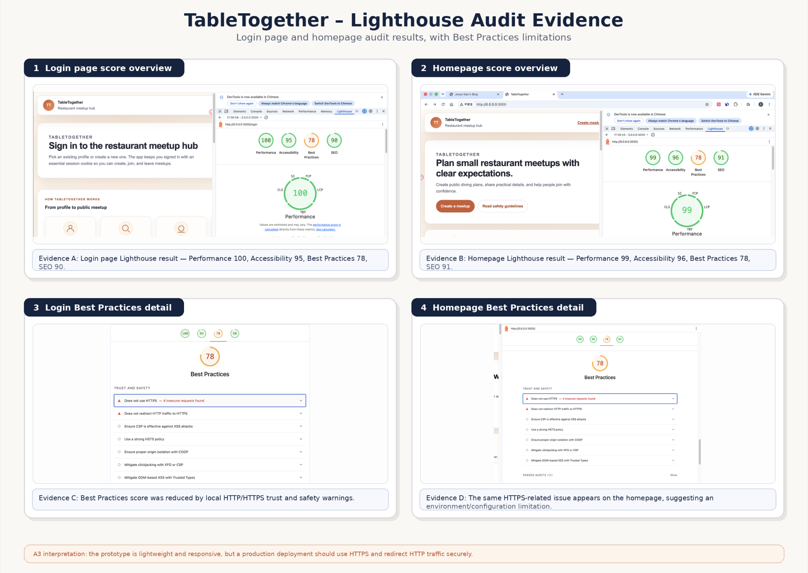
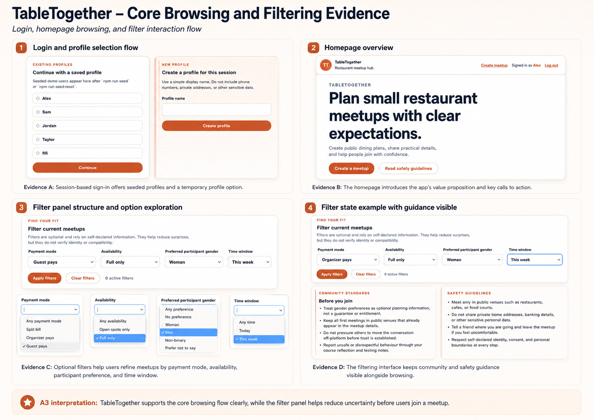
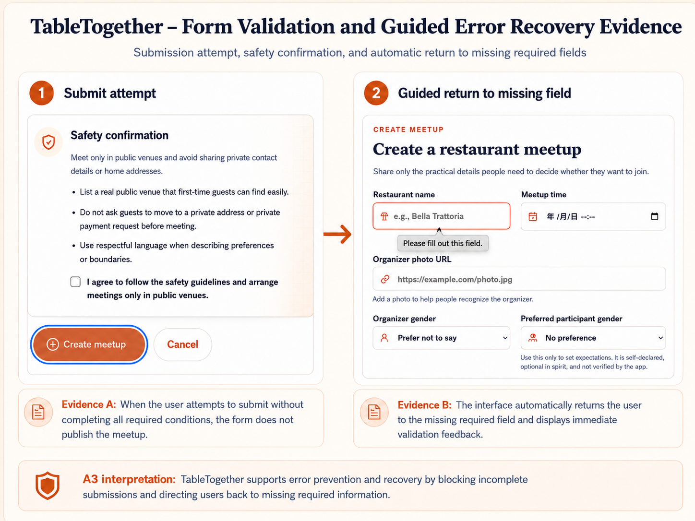
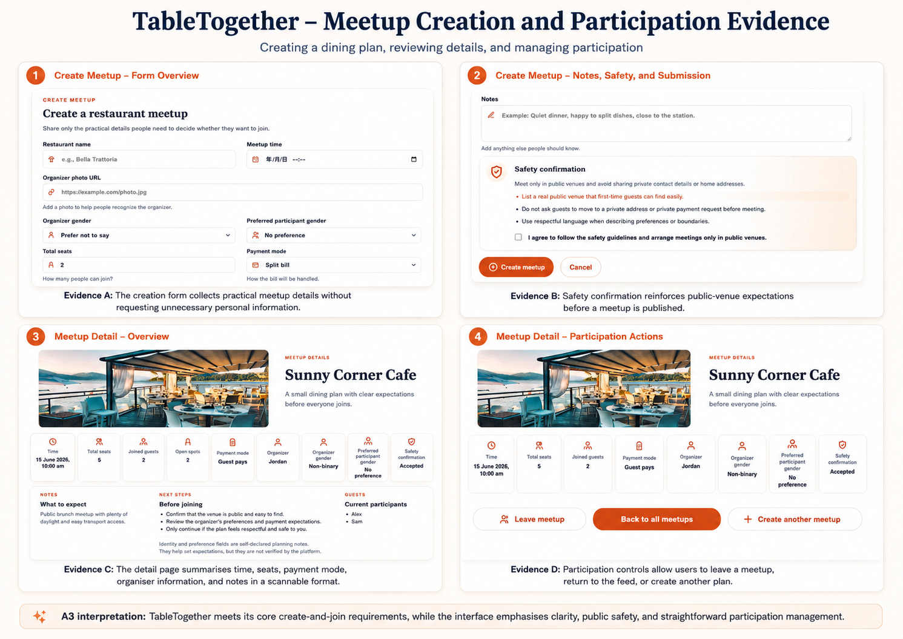

TableTogether is the completed A2 web application prototype created for Bla+Bla. It works as a restaurant meetup hub where users can select a simple profile, browse public dining plans, filter meetups, create a meetup, and join or leave existing tables. This reflection evaluates the prototype as a working web system, not only as a set of completed pages. I focus on performance, user experience, accessibility, functional requirements, and what would need to improve before the project could become a more dependable deployed application.

## 1. Evaluation of Performance and Technical Behaviour

The strongest technical outcome of TableTogether is its lightweight performance at prototype scale. In my Lighthouse audit, the login page scored 100 for Performance and the homepage scored 99. Accessibility was also strong, with 95 on the login page and 96 on the homepage. These results suggest that the app is responsive and not overloaded by unnecessary client-side processing.

*Figure 1. Lighthouse audit evidence showing strong Performance and Accessibility scores, alongside lower Best Practices scores caused by local HTTP/HTTPS trust and safety warnings.*

This performance is closely connected to the application architecture. TableTogether uses MojoJS to render HTML on the server, so the browser receives mostly complete pages rather than waiting for a heavy front-end framework to construct the interface. SQLite also fits the scale of the prototype because the dataset is small and relational: meetups, users, seats, payment modes, and participation states can be managed without complex infrastructure.

The filter interaction also supports performance. Instead of rebuilding the whole page for every filter change, the interface can update relevant meetup content through partial server responses. This keeps the experience dynamic while staying close to standard HTTP request/response logic. For this project, that was a practical trade-off: it improved interaction speed without adding the complexity of a full front-end state management system.

However, the audit also exposed a deployment limitation. Both tested pages scored 78 for Best Practices because my local version used HTTP rather than HTTPS and did not redirect traffic securely. This is not a speed problem, but it is still part of technical behaviour. A meetup system involves profile identity, participation actions, and safety expectations, so a production version would need HTTPS, secure redirection, and deployment-level testing.

## 2. Evaluation of User Experience and Accessibility

The strongest UX decision in TableTogether is that the interface reduces uncertainty before a user joins a meetup. The app is not simply a restaurant list. It is a structured decision-making tool for small social dining plans. The homepage communicates this clearly by framing the app around “small restaurant meetups with clear expectations,” which gives users a clear sense of purpose before they interact with individual meetups.

*Figure 2. Core browsing and filtering evidence showing profile selection, homepage messaging, filter controls, and visible safety guidance.*

The filters are useful because they reflect real conditions that affect whether someone feels comfortable joining. Payment mode, availability, preferred participant gender, and time window are not decorative options; they directly relate to social comfort, planning, and expectation management. By making these conditions visible before joining, the interface reduces the need for private negotiation and helps users compare options more confidently.

The create meetup flow also supports usability through structured input. Instead of asking organisers to write a vague free-text post, the form collects restaurant name, meetup time, seats, payment mode, organiser information, notes, and safety confirmation. This turns a social plan into consistent data that can be reused on the detail page, making the final meetup easier to scan.

*Figure 3. Form validation and guided error recovery evidence showing that incomplete submissions are blocked and users are returned to missing required fields.*

The validation evidence shows effective error prevention. When required information is missing, the app does not publish an incomplete meetup. Instead, the browser returns the user to the missing field and shows immediate feedback. This improves usability because the user knows what to fix at the point of failure, while also protecting the quality of the meetup data.

Accessibility is present, but not complete. The Lighthouse scores suggest that the app avoids major automated issues, and the interface uses semantic form patterns, labelled controls, readable text, and clear buttons. However, automated testing only covers part of accessibility. During keyboard checking, navigation worked at a basic level, but the focus indicator could be stronger and more consistent. For keyboard-only users, it is not enough that an element can be reached; the active element must be visually obvious.

## 3. Critical Reflection and Improvement Planning

The main limitation is that TableTogether is functionally complete as an MVP, but not yet robust as a real community system. The prototype proves the core concept, but some edge cases still depend too much on user interpretation.

The first improvement priority is a proper empty state. If filters return no matching meetups, the interface should not appear blank or unclear. This issue comes from focusing on backend filtering logic more than the user’s interpretation of a zero-result state. A realistic fix would be for the MojoJS controller to pass a `noResults` flag to the template and display a message such as “No meetups match these filters. Try changing the time window or clearing one filter.” This would turn a possible failure state into a guided recovery path.

The second priority is clearer confirmation for state-changing actions. Creating, joining, and leaving a meetup should produce visible confirmation. This could be implemented as a small server-rendered alert or HTMX-updated feedback area. The goal is system transparency: users should know when the application state has changed.

The third improvement is image resilience. External photo URLs kept the MVP simple, but they create dependency on remote image sources. If an image loads slowly or fails, the layout may feel unstable. A fallback placeholder image in the template or CSS would preserve layout integrity.

The fourth improvement is accessibility polish. I would add a high-contrast `:focus-visible` style for buttons, links, form inputs, and filter controls. I would also test with keyboard navigation and at least one screen reader pass, rather than relying only on Lighthouse.

Finally, I would add a limited organiser update field. Excluding direct messaging was the right scope decision because full chat would make the MVP too large. However, organisers may still need to announce delays, booking changes, or venue updates after users join. A simple organiser-only update field would address this gap without turning TableTogether into a messaging platform.

## 4. Retrospective Assessment of Functional Requirements

The final prototype meets the main functional requirements: profile selection, homepage feed, filtering, meetup creation, detail pages, safety guidance, and join/leave participation controls. These were appropriate must-have requirements because they directly support the central value of helping people organise and join restaurant meetups with clearer expectations.

*Figure 4. Meetup creation and participation evidence showing the create form, safety confirmation, meetup detail page, and participation controls.*

The strongest realised requirement was not simply “create a meetup,” but “create a structured dining plan.” The create form captures practical information such as time, seats, payment mode, organiser details, participant preferences, notes, and safety confirmation. This makes the detail page more useful because participants can evaluate the meetup without needing extra explanation from the organiser.

The join and leave requirements also make TableTogether an application rather than a static information site. The detail page shows joined guests, open spots, payment expectations, organiser identity, safety confirmation, and next steps. This supports decision-making at the point of participation.

However, the evaluation shows that my original requirements were incomplete in two areas. First, I underestimated feedback states such as empty results and action confirmations. Second, I focused more on pre-join clarity than post-join coordination. The prototype helps users decide whether to join, but it does not yet support communication after they have joined. This is why an organiser update field would be a better future requirement than full direct messaging.

## Conclusion

TableTogether taught me that a working web app should be evaluated through behaviour, not just feature completion. MojoJS, SQLite, and partial updates helped create a lightweight prototype, but testing showed that reliability also depends on deployment security, feedback states, accessibility, and edge-case handling. The project successfully proves the restaurant meetup concept while showing the difference between a functional prototype and a dependable deployed system.